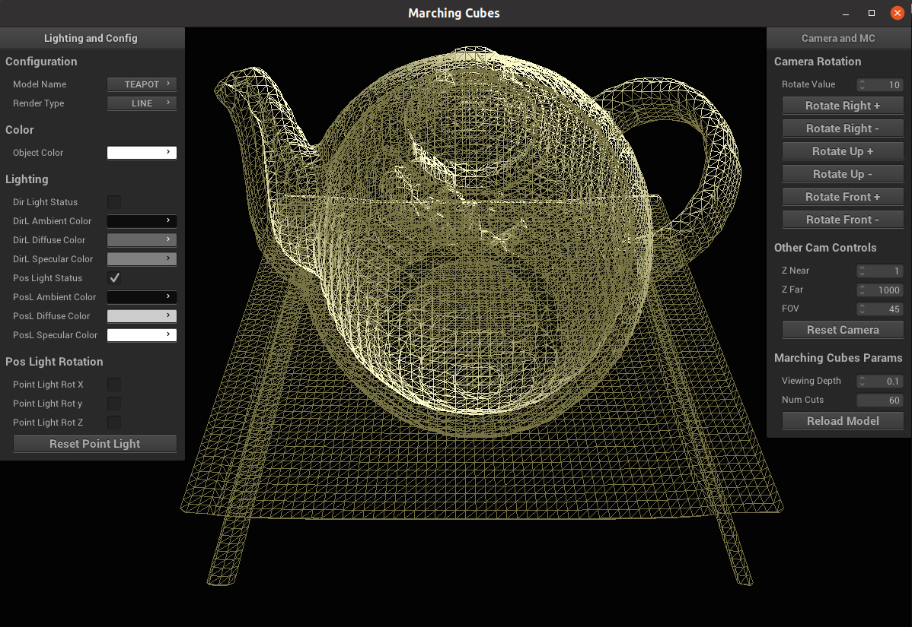

# Problem Summary

I worked on implementing the Marching Cubes algorithm for my final project. Marching Cubes
is an isosurface extraction algorithm that is quite popular and has spurned a lot
of research in the computer graphics community. It has a certain elegance and simplicity
to it and is also quite fast in nature when compared to direct rendering based methods.
It is important from the point of view of vizualization applications involving 3D data.

# Description of Work

- Initial time was spent in reading about the alogorithm and its implementation aspects. I
  first tried to understand how the 2D counterpart (marching squares) worked and this provided
  me with an intuition for the technique.

- The 2D example also helped in debugging the design of grid system. The grid is not fixed
  and its resolution is controlled by the end user. Hence it was a bit tricky for me to
  fill the grid points and assign them interpolated values from the voxel data.

- On making a grid with points assigned interpolated values from the raw (voxel) data,
  the next stage involved using the pre-defined lookup tables (obtained via the internet)
  to obtain the edges on which the vertices constituting the surface mesh lie.

- A triangular face was obtained by iterating over the lookup table 3 indices at a time.
  The face's associated normal was constructed by taking a cross product between the vectors
  defining any two edges of the triangle. Each vertex for the triangular face was assigned
  this normal and the position and normal data was passed to the vertex shader.
  This was useful for lighting up the scene.

- Finally all the bits and pieces were integrated into the existing pipeline of: Camera, 
  Lighting, Object, and Renderer classes in the code. Using the normal information for each
  vertex point, I could use the basic Phong model to show lighting in the scene.

- Additional 3D raw data sets were downloaded from internet (https://klacansky.com/open-scivis-datasets/)
  to showcase the rendering results.

## Challenges

- Indexing into the grid and voxel data depending on the number of cuts. This was a bit
  non-intuitive at first and need careful attention to avoid mistakes.

- Work to do: obtaining a better normal representation for each vertex, probably by taking
  the average of normals across all the faces that the vertex lies on.

# Results
A complete C++/OpenGL GUI application has been developed as a part of the project. The
GUI allows to change the following variables related to marching cubes algorithm:

- 3D volume data set
- Number of slices (Grid resolution, higher is better)
- Isovalue: Value at which to extract the surface

In addition GUI knobs for parameters like rendering type, camera movement, lighting etc
are also provided for ease of use. Figures are included with appropriate captions in order
to demonstrate some rendering results across different data sets.

{width=49%} \ {width=49%}
{width=49%} \ {width=49%}
{width=49%} \ {width=49%}
\begin{figure}[!h]
\caption{Bonsai: Varying the isolevel for surface extraction}
\end{figure}

{width=49%} \ {width=49%}
{width=49%} \ {width=49%}
{width=49%} \ {width=49%}
\begin{figure}[!h]
\caption{Teapot: Varying the isolevel for surface extraction}
\end{figure}

{width=60%} \ {width=60%}
{width=60%}
\begin{figure}[!h]
\caption{Surface Mesh in Wireframe rendering mode}
\end{figure}

{width=49%} \ {width=49%}
{width=49%} \ {width=49%}
{width=49%} \ {width=49%}
\begin{figure}[!h]
\caption{Bonsai: Varying the number of slices (grid resolution)}
\end{figure}

{width=49%} \ {width=49%}
{width=49%} \ {width=49%}
\begin{figure}[!h]
\caption{Teapot: Varying the number of slices (grid resolution)}
\end{figure}

# Analysis of Work

I believe that I was successful in my main aim of understanding and implementing marching
cubes algorithm. I had taken up this project (and changed my original proposal) in order
to explore something different and allow myself to learn about a technique which is widely 
used. However, I can see an area of improvement in terms of better shading techniques for
the 3d models. This needs more accurate normal computation for the vertex data points
which I was not able to finish due to a lack of time but, I will try to take this up later 
on as I suspect that I might not need to change my code too much.
Apart from the above point, I plan to continue reading about extensions to the original
algorithm and related techniques like dual contouring etc. as I have gained the 
prerequisite knowledge to go through the different techniques. I had initially thought
about implementing dual contouring as well but could not do this since I based my code
heavily on the assumption of independent computation of grid cells (valid for marching cubes)
which, however, is not true for dual contouring.

# References

- Marching Cubes: Lorensen, William E., and Harvey E. Cline. "Marching cubes: A high resolution 3D surface
  construction algorithm." ACM siggraph Computer Graphics (1987).

- Dual Contouring: Ju, Tao, et al. "Dual contouring of hermite data." Proceedings of the 
  29th annual conference on Computer graphics and interactive techniques (2002).

- 3D Volume data sets: [https://klacansky.com/open-scivis-datasets/](https://klacansky.com/open-scivis-datasets/)

- Implementation Details:
  - [http://paulbourke.net/geometry/polygonise/](http://paulbourke.net/geometry/polygonise/)
  - [http://www.it.hiof.no/~borres/j3d/explain/marching/p-march.html](http://www.it.hiof.no/~borres/j3d/explain/marching/p-march.html)
  - [https://www.boristhebrave.com/2018/04/15/marching-cubes-tutorial/](https://www.boristhebrave.com/2018/04/15/marching-cubes-tutorial)

- GitHub Repository for the project:
  [https://github.com/kninad/marching-cubes-graphics](https://github.com/kninad/marching-cubes-graphics)
